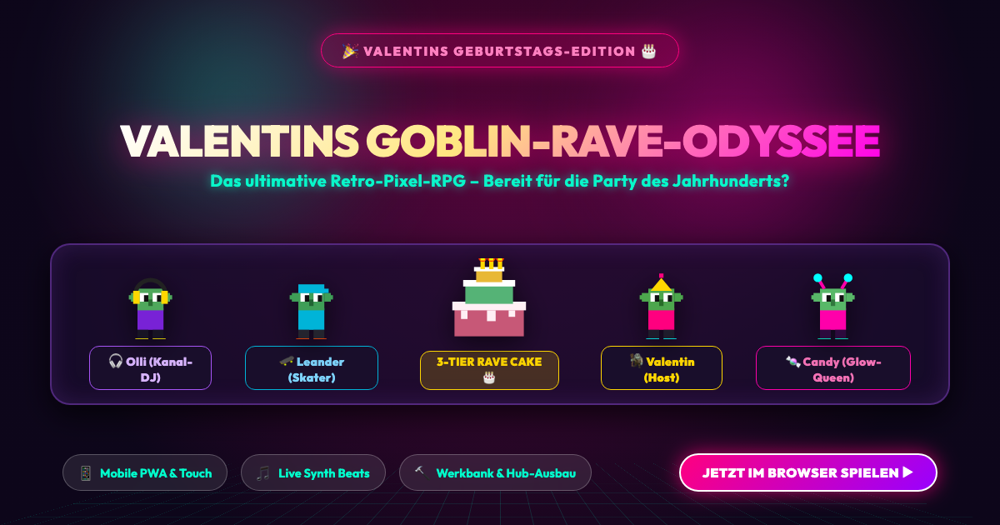

# 🧌 Valentins Geburtstag: Die Goblin-Rave-Odyssee 🎂✨



> **🎉 Live im Browser spielen:**  
> **👉 [https://oliver19xx.github.io/goblin-village-adventure/](https://oliver19xx.github.io/goblin-village-adventure/)**

Ein charmantes 2D Top-Down Retro-Pixel-RPG für den Browser und Smartphones mit Crafting-System, interaktiven Quests, dynamischer Chiptune-WebAudio-Engine, PWA-Support und zelebriertem Geburtstags-Finale!

---

## 📖 Die Geschichte

Heute feiert der Goblin **Valentin** seinen Geburtstag! Um die legendärste Geburtstagsparty aller Zeiten zu schmeißen, muss Valentin seinen Bauwagenplatz in einen Rave-Hotspot verwandeln. Doch seine besten Freunde sind noch verstreut auf geheimen Underground-Raves in der ganzen Stadt unterwegs:

1. **🎧 Olli (Kanal-Rave)**: Hat sein Master-Vinyl und das vergoldete Klinkenkabel im Schilf verloren.
2. **🛹 Leander (Skatehalle)**: Braucht High-Speed Keramik-Rollen und eiskalte Goblin-Energy für sein Skateboard.
3. **🍬 Candy (Autobahnbrücke)**: Sucht eine Zündkerze für ihre Nebelmaschine und Glitzer-Sirup für den leuchtenden Geburtstagspunch.

Reise durch die Teleport-Portale zu den Raves, hilf deinen Freunden bei ihren Quests, sammle Bauholz, Kabel und Knicklichter und baue im Party-Hub das DJ-Pult, die Skater-Lounge, die Glow-Drink-Bar und die Discokugeln auf!

---

## 🎂 Das Geburtstags-Finale

1. **🔨 Kuchen backen:** Backe an der Werkbank im Party-Hub den gigantischen 3-Tier-Geburtstagskuchen.
2. **🎉 Partytisch in der Mitte:** Trage den Kuchen zum festlich geschmückten Tisch im Zentrum des Bauwagenplatzes.
3. **🪩 Die Party des Jahrhunderts:** Sobald der Kuchen platziert ist, starten alle Freunde den synchronen Goblin-Tanz, Kerzenlichter und Konfetti-Feuerwerk erleuchten den Platz und die triumphale Rave-Fanfare ertönt!

---

## 🗺️ Die Zonen

- **🧌 Valentins Party-Hub (Bauwagenplatz):** Dein Basislager mit Werkbank, Portalen, zentralem Partytisch und erweiterbarer Party-Dekoration.
- **🎧 Kanal-Open-Air:** Gemütlicher Rave am Wasser mit Schilf, Bootwrack und Chillout-Klängen.
- **🛹 Skatehalle:** Warehouse mit Halfpipe-Rampen, Quarterpipes und schnellen Skate-Vibes.
- **🍬 Autobahnbrücke:** Untergrund-Rave mit Betonpfeilern, Stroboskop-Lichtern und Nebelwerfern.

---

## 📱 Mobile-First & PWA-Features

- **Optimiert für Smartphone-Hochformat:** Responsives Layout für Bildschirme von 360px bis 430px Breite (9:16 bis 9:19.5).
- **Mobile Touch-Steuerung:** Virtueller Analog-Stick für flüssige Bewegung und ergonomische Daumen-Buttons (`[E]` Interagieren, `[🔨]` Werkbank, `[📜]` Quests).
- **Progressive Web App (PWA):** Kann direkt über den Browser auf den Homescreen installiert werden und läuft im Vollbild wie eine native App.
- **Auto-Audio Unlocking:** Barrierefreier Start-Banner entsperrt Web Audio zuverlässig auf iOS Safari und Android Chrome.

---

## 🎮 Steuerung

| Eingabe | Aktion |
|---|---|
| <kbd>W</kbd> <kbd>A</kbd> <kbd>S</kbd> <kbd>D</kbd> / Pfeiltasten | Valentin bewegen |
| <kbd>E</kbd> / <kbd>Leertaste</kbd> / <kbd>Enter</kbd> | Interagieren / Sprechen / Aufsammeln / Portal nutzen / Kuchen platzieren |
| <kbd>C</kbd> | Werkbank & Ausbau-Menü öffnen |
| <kbd>Q</kbd> | Quest-Tagebuch öffnen |
| <kbd>M</kbd> | Sound & Musik stummschalten / aktivieren |
| **📱 Mobile Touch** | Virtueller Analog-Stick (unten links) & Action-Buttons `E`, `🔨`, `📜` (unten rechts) |

---

## 🛠️ Technologien

- **[Phaser 3](https://phaser.io/)** (v3.88+) – 2D Canvas & WebGL Game Engine mit dynamischem Resize & Pixel-Art-Pipeline.
- **TypeScript & Vite** – Typensichere Codebasis und blitzschnelle Build-Pipeline.
- **Web Audio API Sound-Synthesizer** – Mehrspurige Chiptune/Synthwave-Engine mit beat-synchronem Layering:
  - 🥁 *Drums & Hi-Hats* (Basis-Rhythmus)
  - 🎸 *Ollis Bassline* (Freigeschaltet nach Ollis Quest)
  - 🎹 *Leanders Lead-Synth* (Freigeschaltet nach Leanders Quest)
  - ✨ *Candys Arpeggio-Synth* (Freigeschaltet nach Candys Quest)
  - 🎺 *Geburtstags-Fanfare & Finale-Akkorde* (Beim Platzieren des Kuchens)
- **LocalStorage & JSON SaveSystem** – Automatisches Speichern des Spielstands sowie JSON-Export/Import.
- **Open Graph & Twitter Cards** – Rich Media Vorschaukarten für WhatsApp, iMessage, Discord, Twitter/X & Co.

---

## 💻 Lokale Entwicklung

```bash
# Repository klonen
git clone https://github.com/Oliver19xx/goblin-village-adventure.git
cd goblin-village-adventure

# Abhängigkeiten installieren
npm install

# Lokalen Dev-Server starten
npm run dev

# Produktionsträchtigen Build erstellen & testen
npm run build
node scratch/e2e_test.js
```
